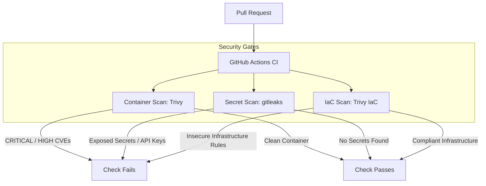

# pipeline-gatekeeper

A personal learning project demonstrating automated security gating patterns in GitHub Actions CI/CD pipelines. It wires together open-source security scanners to detect known critical vulnerabilities in container images, accidentally committed secrets, and Terraform configurations that violate baseline security policies.

> **Note:** This is a personal learning project built to test and prove security integration patterns. It is not intended for production workloads, and branch protection enforcement is a known gap, not yet configured (see Verification Proof below).

---

## Architecture



---

## Security Gates & Tool Choices

### 1. Container Vulnerability Scanning (Trivy)

**What it catches:** Known vulnerabilities (CVEs) in base image OS packages (Debian/APT) and application language dependencies (pip/requirements.txt).

**Tool choice:** Trivy runs as a fast, stateless single binary with no background daemon or database server, scanning both OS and application layers in a single pass. Configured with `--exit-code 1` targeting CRITICAL and HIGH severities only, to avoid noise from low-severity findings.

### 2. Secret Detection (gitleaks)

**What it catches:** Hardcoded API keys, private tokens, AWS credentials, and other high-entropy secret patterns across repository commits.

**Tool choice:** gitleaks was chosen for its speed and direct git history inspection. `fetch-depth: 0` is set on checkout so it scans full commit history deltas, not just a shallow snapshot.

### 3. Terraform Policy Scanning (Trivy IaC)

**What it catches:** Security misconfigurations in Infrastructure as Code, such as unencrypted storage volumes or missing public-access restrictions.

**Tool choice:** Trivy IaC (using tfsec rulesets) was chosen to keep a single scanner tool covering both container and Terraform checks, rather than adding a separate IaC-specific tool.

---

## Verification Proof

To prove the pipeline actually detects violations rather than passing silently, deliberate violations were introduced on a branch (`demo/security-violations`) and opened as Pull Request #1:

- **Container gate:** introduced `pillow==8.2.0`, which contains a known critical remote-code-execution CVE
- **Secret gate:** committed a hardcoded GitHub personal access token format (`ghp_...`) in `config.py`
- **IaC gate:** added an unencrypted AWS EBS volume (`encrypted = false`) to `terraform/main.tf`

All three checks failed as expected:


**Important limitation found during this test:** despite all three checks failing, GitHub still showed the PR as mergeable ("No conflicts with base branch. Merging can be performed automatically"). The checks detect violations correctly, but nothing was actually blocking the merge itself, because branch protection rules requiring these checks to pass before merge were never configured on the repository. Detection and enforcement are two different things, and this project currently only proves the former. Adding a required-status-checks branch protection rule is the natural next step to close that gap.

**Second limitation found:** gitleaks attempted to post a summary comment directly on the PR and failed with `HttpError: Resource not accessible by integration`, likely because the workflow's default `GITHUB_TOKEN` didn't have `pull-requests: write` permission. The scan itself still ran and correctly reported the leaked secret in the job summary and logs, just not as an inline PR comment.


Once the deliberate violations were reverted, all three checks passed cleanly:

- Container Vulnerability Scan: passed
- Secret Detection (gitleaks): passed
- Terraform Policy Scan (Trivy IaC): passed

---

## Project Structure

```
pipeline-gatekeeper/
├── .github/
│   └── workflows/
│       └── security-gate.yml      # Multi-job GitHub Actions workflow definition
├── images/
│   ├── gitleaks-failure-log.png   # Screenshot of gitleaks terminal finding
│   └── pr-failing-checks.png      # Screenshot of GitHub PR check results
├── terraform/
│   └── main.tf                    # Baseline compliant AWS S3 Terraform configuration
├── .gitignore
├── .trivyignore                   # Trivy base-image vendor metadata ignore list
├── Dockerfile
├── main.py                        # FastAPI target service used as the scan subject
├── requirements.txt
└── README.md
```

---
